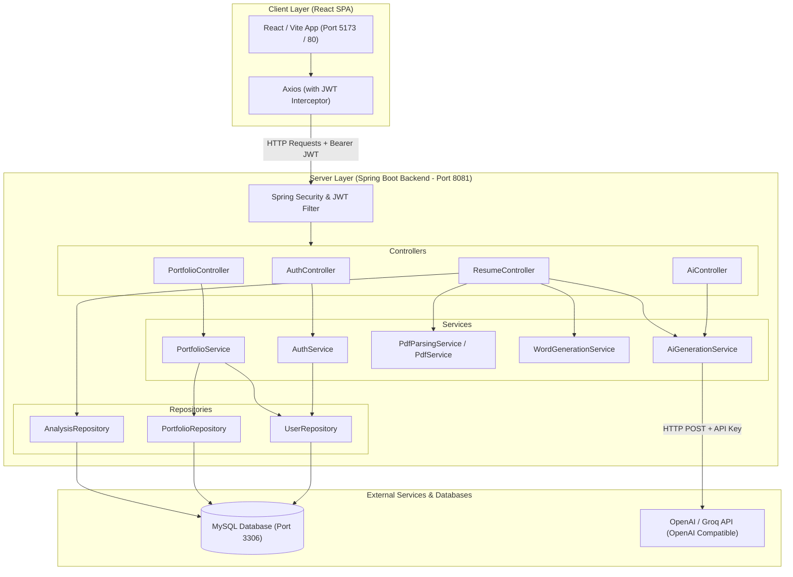
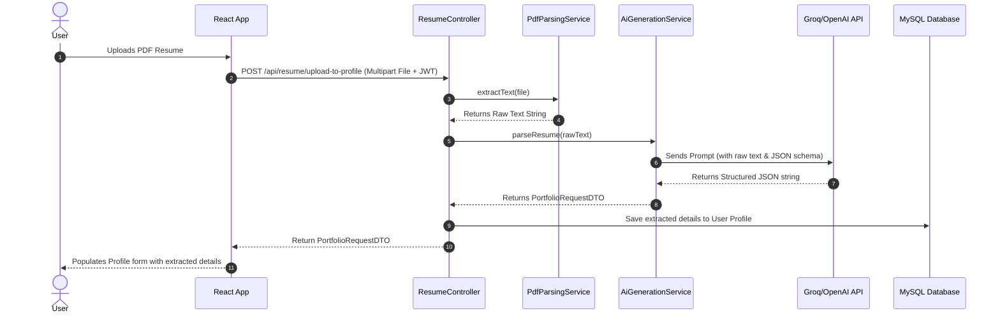

# CodeFolio: AI Portfolio Generator & Profile Evaluator

CodeFolio is a production-ready, full-stack SaaS application that enables developers to parse their resume PDFs, get structured candidate profiles, evaluate their resume fit against specific target job roles, and automatically generate professional, recruiter-friendly single-page HTML portfolio websites or a downloadable, modular React application.

---

## Table of Contents
1. [Core Features](#core-features)
2. [System Architecture](#system-architecture)
   - [High-Level Architecture Diagram](#high-level-architecture-diagram)
   - [Resume Parsing & Analysis Sequence](#resume-parsing--analysis-sequence)
3. [Technology Stack](#technology-stack)
4. [Project Structure](#project-structure)
5. [Local Development Setup](#local-development-setup)
   - [Prerequisites](#prerequisites)
   - [Database Setup](#1-database-setup)
   - [Environment Configuration](#2-environment-configuration)
   - [Running the Backend](#3-running-the-backend-spring-boot)
   - [Running the Frontend](#4-running-the-frontend-react)
6. [Docker Deployment Guide](#docker-deployment-guide)
7. [API Documentation Reference](#api-documentation-reference)

---

## Core Features

- **📄 AI Resume Parsing:** Upload a text-based PDF resume. The system extracts raw text via Apache PDFBox, processes it with LLMs, and maps it into a structured user profile schema (name, email, phone, links, skills, experience, projects).
- **📊 Profile Analytics & Scoring:** Evaluates user profile details against target roles, generating a realistic 0-100 match score, strengths/weaknesses breakdown, and actionable improvement recommendations.
- **📝 Exportable Word Reports:** Generates download-ready MS Word (`.docx`) analysis reports detailing recruitment feedback using Apache POI.
- **🎨 Dynamic Portfolio Customization:** Allows users to choose templates (*Minimal, Professional, Developer, Creative, Modern Premium*) and customize options:
  - **Colors & Typography:** Theme color codes and custom Google Fonts (*Inter, Roboto, Outfit, Fira Code*, etc.).
  - **Background Styles:** Solid color, gradients, mesh gradients, or particle backgrounds.
  - **Section Control:** Drag-and-drop or order-based positioning (*Skills, Experience, Projects*) with custom corner styles (*Sharp, Rounded, Pill*) and spacing (*Compact, Comfortable, Spacious*).
- **💻 Full Codebase ZIP Generation:** Packages a custom React single-page portfolio complete with components, styles, dynamic configurations, and Vite toolchain as a downloadable ZIP.
- **🔐 JWT Authentication:** Secure registration and login flow with state-maintained sessions and endpoint-level authorization checks.

---

## System Architecture

CodeFolio follows a multi-tier client-server architecture consisting of a **React Single-Page Application (SPA)** front-end, a **Spring Boot REST API** backend, a persistent **MySQL Database**, and integrations with **OpenAI-compatible LLM APIs** (such as Groq or local hosting).

### High-Level Architecture Diagram



### Resume Parsing & Analysis Sequence

The sequence diagram below displays how the application extracts, evaluates, and parses a resume:



---

## Technology Stack

### Frontend
- **Framework:** React 19
- **Build Tool:** Vite 5
- **Styling:** CSS variables for dynamic themes, custom responsive styles (`index.css`, `modern.css`), Tailwind CSS 4
- **Router:** React Router DOM 7
- **HTTP Client:** Axios with JWT Interceptors
- **Icons:** Lucide React

### Backend
- **Framework:** Spring Boot 2.7.18
- **Language:** Java 17
- **Security:** Spring Security + JSON Web Token (JJWT 0.11.5)
- **Database Access:** Spring Data JPA + Hibernate
- **Document Processing:** 
  - **Apache PDFBox 3.0.0** (PDF text extraction)
  - **Apache POI 5.2.3** (Microsoft Word `.docx` report generation)
- **API Documentation:** Springdoc OpenAPI (Swagger UI) 1.7.0

### Database & Devops
- **Database:** MySQL 8.0
- **Containerization:** Docker, Docker Compose
- **Web Server:** Nginx (used for static React hosting in Docker environments)

---

## Project Structure

```text
CodeFolio-main/
│
├── frontend/                        # Frontend React Application
│   ├── public/                      # Static Assets
│   └── src/
│       ├── assets/                  # Images and Logos
│       ├── components/              # Reusable UI Components
│       │   ├── Layout.jsx           # Global Layout (Navbar, Sidebar)
│       │   ├── Loader.jsx           # Spinner Overlay
│       │   ├── PortfolioCard.jsx    # Individual Portfolio Card
│       │   └── PortfolioForm.jsx    # Multi-step Profile Data Form
│       ├── context/                 # State Providers
│       │   └── AuthContext.jsx      # Authentication & User Session Provider
│       ├── pages/                   # Route Pages
│       │   ├── Dashboard.jsx        # Landing Area for Logged-In Users
│       │   ├── Editor.jsx           # Portfolio Customization Workspace
│       │   ├── LandingPage.jsx      # Marketing Landing Page
│       │   ├── LoginPage.jsx        # User Login Page
│       │   ├── PortfolioDetail.jsx  # Detailed Preview, HTML/React Download
│       │   ├── ProfilePage.jsx      # Detailed Profile & Resume Parsing
│       │   └── SignupPage.jsx       # User Signup Page
│       ├── services/
│       │   └── api.js               # Axios instance with JWT interceptor
│       ├── App.jsx                  # Root Component
│       ├── index.css                # Base Layout CSS
│       └── modern.css               # Theme-specific CSS Styling
│
└── src/                             # Backend Spring Boot Application
    └── main/
        ├── java/org/example/portfolioai/
        │   ├── config/              # Security and App configuration
        │   │   ├── AppConfig.java
        │   │   ├── JwtAuthenticationFilter.java
        │   │   ├── OpenApiConfig.java
        │   │   └── SecurityConfig.java
        │   ├── controller/          # REST Controller Endpoints
        │   │   ├── AiController.java
        │   │   ├── AuthController.java
        │   │   ├── PortfolioController.java
        │   │   └── ResumeController.java
        │   ├── dto/                 # Data Transfer Objects
        │   │   ├── AiRequestDTO.java
        │   │   ├── AiResponseDTO.java
        │   │   ├── AnalysisResponseDTO.java
        │   │   ├── PortfolioRequestDTO.java
        │   │   └── PortfolioResponseDTO.java
        │   ├── entity/              # Database Entity Models
        │   │   ├── AnalysisEntity.java
        │   │   ├── PortfolioEntity.java
        │   │   └── UserEntity.java
        │   ├── exception/           # Exception Handling Rules
        │   │   └── GlobalExceptionHandler.java
        │   ├── repository/          # JPA Repositories
        │   │   ├── AnalysisRepository.java
        │   │   ├── PortfolioRepository.java
        │   │   └── UserRepository.java
        │   ├── service/             # Business Logic Layer
        │   │   ├── AiGenerationService.java
        │   │   ├── AuthService.java
        │   │   ├── CustomUserDetailsService.java
        │   │   ├── PdfParsingService.java
        │   │   ├── PortfolioService.java
        │   │   └── WordGenerationService.java
        │   └── util/
        │       ├── JwtUtil.java
        │       └── PromptBuilder.java
        └── resources/
            └── application.properties # Server and Database Config
```

---

## Local Development Setup

### Prerequisites
- **Java 17 Development Kit (JDK)**
- **Maven**
- **Node.js** (v18+) & **npm**
- **MySQL Server** (v8.0)

---

### 1. Database Setup
Launch your MySQL Command Line or Workbench, and run the query:
```sql
CREATE DATABASE portfoliohappy_db;
```

Update your connection credentials in [application.properties](file:///C:/Users/piseg/Downloads/CodeFolio-main/CodeFolio-main/src/main/resources/application.properties):
```properties
spring.datasource.username=root
spring.datasource.password=your_mysql_password
```

---

### 2. Environment Configuration
Create a `.env` file in the root of the project (similar to [.env.example](file:///C:/Users/piseg/Downloads/CodeFolio-main/CodeFolio-main/.env.example)):
```env
SERVER_PORT=8081
DB_HOST=localhost
DB_PORT=3306
DB_NAME=portfoliohappy_db
DB_USERNAME=root
DB_PASSWORD=your_mysql_password

# OpenAI Compatible API URL (e.g., Groq, OpenAI, or LocalAI)
AI_API_URL=https://api.groq.com/openai/v1/chat/completions
AI_API_KEY=your-api-key-here
AI_API_MODEL=llama-3.3-70b-versatile

# JWT HMAC Secret Key (minimum 256 bits / 32 characters)
JWT_SECRET=your_jwt_secret_must_be_long_and_secure_32_characters
```

---

### 3. Running the Backend (Spring Boot)
1. Open a terminal in the inner project folder containing `pom.xml`.
2. Compile and run the backend using Maven:
   ```bash
   mvn spring-boot:run
   ```
3. The server starts on **`http://localhost:8081`**.
4. Check the interactive REST API Swagger docs at: **`http://localhost:8081/swagger-ui/index.html`**

---

### 4. Running the Frontend (React)
1. Open another terminal window and navigate to the frontend directory:
   ```bash
   cd frontend
   ```
2. Install the necessary node dependencies:
   ```bash
   npm install
   ```
3. Launch the development server:
   ```bash
   npm run dev
   ```
4. The client will start on **`http://localhost:5173`**.

---

## Docker Deployment Guide

For local containers, a [docker-compose.yml](file:///C:/Users/piseg/Downloads/CodeFolio-main/CodeFolio-main/docker-compose.yml) config is provided. Make sure to define the credentials in `.env`.

### Step 1: Set Variables in `.env`
Save your environment settings inside `.env` in the project root directory.

### Step 2: Build and Run Services
Run the following docker command:
```bash
docker-compose up --build
```
This builds and launches three container services:
1. **`portfolio-db`**: MySQL database container.
2. **`portfolio-backend`**: Spring Boot application running on port `8081`.
3. **`portfolio-frontend`**: React web application built with Nginx, exposed on port `80` (HTTP).

Open **`http://localhost`** in your browser to access the website.

---

## API Documentation Reference

Here are the key REST endpoints exposed by the CodeFolio API:

### Authentication (`/api/auth`)
| Method | Endpoint | Description | Auth Required |
| :--- | :--- | :--- | :---: |
| **POST** | `/api/auth/register` | Register a new user account | No |
| **POST** | `/api/auth/login` | Login and receive JWT access token | No |
| **GET** | `/api/auth/me` | Fetch currently logged-in user profile | Yes (Bearer JWT) |
| **PUT** | `/api/auth/profile` | Update profile fields manually | Yes (Bearer JWT) |

### AI Generators (`/api/ai`)
| Method | Endpoint | Description | Auth Required |
| :--- | :--- | :--- | :---: |
| **POST** | `/api/ai/generate-bio` | Generate AI bio from skills/projects info | Yes (Bearer JWT) |
| **POST** | `/api/ai/generate-website` | Generate a single-page HTML portfolio | Yes (Bearer JWT) |
| **POST** | `/api/ai/analyze-profile` | Run suitability feedback check on profile details | Yes (Bearer JWT) |
| **POST** | `/api/ai/download-react` | Generate full React codebase package (.zip) | Yes (Bearer JWT) |

### Resume Management (`/api/resume`)
| Method | Endpoint | Description | Auth Required |
| :--- | :--- | :--- | :---: |
| **POST** | `/api/resume/upload` | Parse PDF resume text into profile details | Yes (Bearer JWT) |
| **POST** | `/api/resume/upload-to-profile` | Parse PDF and auto-update user profile details | Yes (Bearer JWT) |
| **POST** | `/api/resume/analyze` | Evaluate current user profile against target role | Yes (Bearer JWT) |
| **GET** | `/api/resume/last-analysis` | Get latest profile suitability feedback | Yes (Bearer JWT) |
| **GET** | `/api/resume/analyze/{id}/download` | Download POI Word (.docx) report of evaluation | No |

### Saved Portfolios (`/api/portfolios`)
| Method | Endpoint | Description | Auth Required |
| :--- | :--- | :--- | :---: |
| **POST** | `/api/portfolios` | Save a generated portfolio | Yes (Bearer JWT) |
| **GET** | `/api/portfolios` | Get list of all saved portfolios for user | Yes (Bearer JWT) |
| **GET** | `/api/portfolios/{id}` | Retrieve specific portfolio | Yes (Bearer JWT) |
| **DELETE**| `/api/portfolios/{id}` | Delete a portfolio | Yes (Bearer JWT) |
